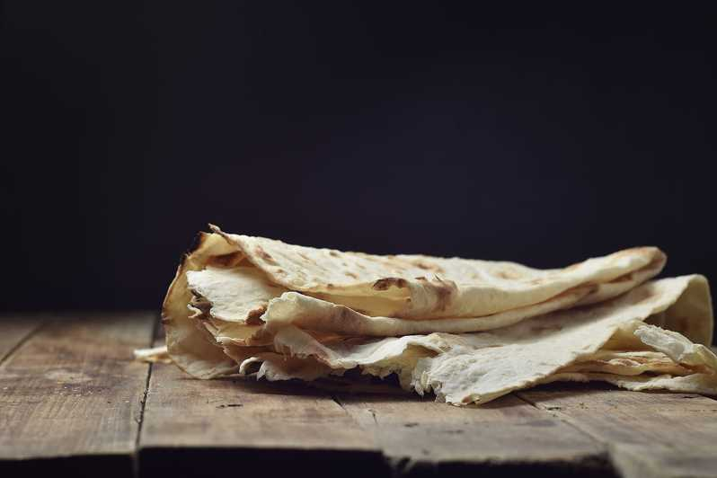
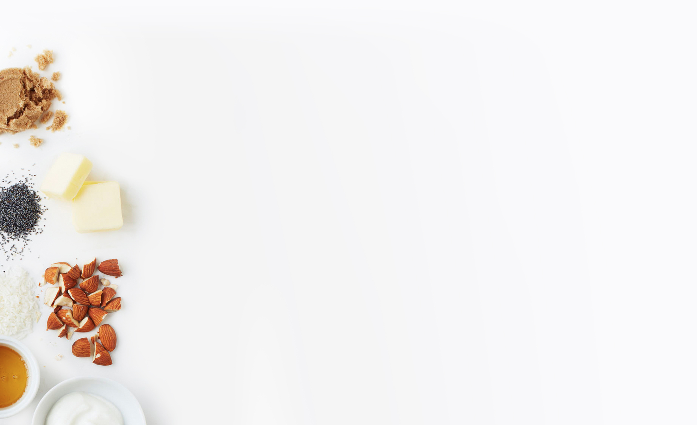

<!DOCTYPE html>
<html lang="ru">
<head>
    <meta charset="UTF-8">
    <meta http-equiv="X-UA-Compatible" content="IE=edge">
    <meta name="viewport" content="width=device-width, initial-scale=1.0">
    <link rel="stylesheet" href="base.css">
    <link rel="stylesheet" href="https://cdn.jsdelivr.net/npm/bootstrap@5.1.3/dist/css/bootstrap.min.css" integrity="sha384-1BmE4kWBq78iYhFldvKuhfTAU6auU8tT94WrHftjDbrCEXSU1oBoqyl2QvZ6jIW3" crossorigin="anonymous">
    <!-- <link rel="stylesheet" href="base_responsive.css"> -->
    <title>Заказ лаваша</title>
</head>
<body>
    <header class="header">Лаваш в Томске</header>
    

        

            

            

            

        

        

            
40 руб

            
40 руб

            
40 руб

        

    

</body>
</html>
